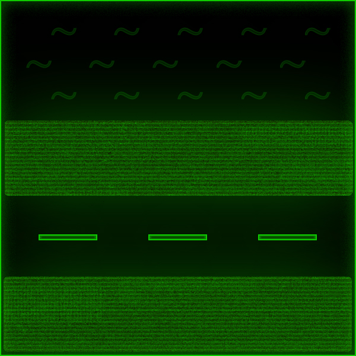
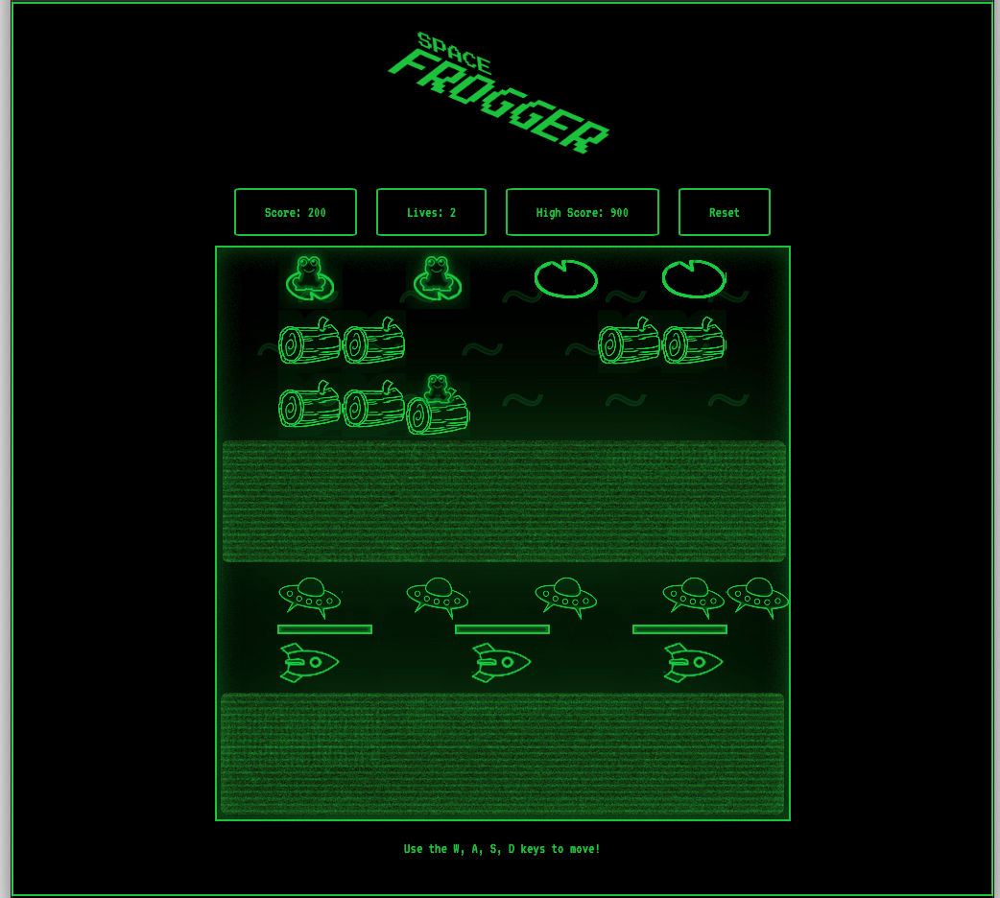
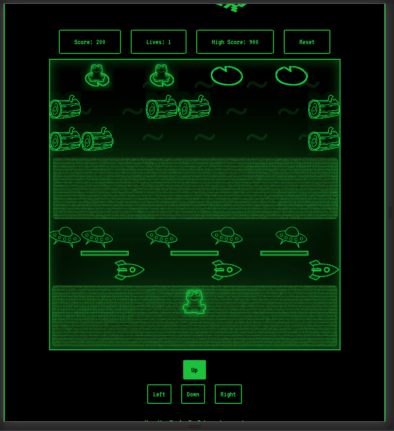

###  

### General Assembly, Software Engineering Immersive

# Space Frogger
 

## Overview

This is my first project of the software engineering immersive course at GA London. The assignment was to create a grid-based game to be rendered in the browser, using HTML, CSS and JavaScript. The project was to be completed **individually** within **one week**.

Given a list of options from GA, I chose to re-create the classic game **Frogger**. 

You can launch the game on GitHub pages [here](https://dec1992.github.io/project-1/), or find the GitHub repo [here](https://github.com/dec1992/project-1).

## Brief

- **Render a game in the browser**
- **Design logic for winning & visually display which player won**
- **Include separate HTML / CSS / JavaScript files**
- Use **Javascript** for **DOM manipulation**
- **Deploy your game online**, where the rest of the world can access it
- Use **semantic markup** for HTML and CSS (adhere to best practices)

## Technologies used

- HTML
- CSS
- JavaScript (ES6)
- Git and GitHub
- Adobe Photoshop
- Adobe Illustrator
- Google Fonts

## Approach

### Board layout 

- I used a for loop to create the desired number of divs, add the class 'cell' to each new div, append the divs to the grid, and then push them into an array named 'cells'.

- I sliced the 'cells' array into seperate arrays in order to designate them with classes such as 'grass' or 'water' in order to create the level. This allowed me to add a class of 'loselife' to the water cells which would later trigger the player to lose lives accordingly.

  

  ```js
  for (let i = 0; i < width ** 2; i++) {
  const div = document.createElement('div')
  div.classList.add('cell')
  grid.appendChild(div)
  // div.innerHTML = i
  cells.push(div)
	}

	const grass1 = cells.slice(63)
	grass1.forEach((div) => {
  	div.classList.add('grass')
	})

	const grass2 = cells.slice(27, 45)
	grass2.forEach((div) => {
  	div.classList.add('grass')
	})

	const road = cells.slice(45, 63)
	road.forEach((div) => {
  	div.classList.add('road')
	})

	const water = cells.slice(0, 27)
	water.forEach((div) => {
 	div.classList.add('water')
  	div.classList.add('loselife')
	})  
	```

### Frog movement 
- A single event listener is used for the main frog movement. The event listener is listening for keypresses, and using if statements to differentiate between directions.
- The if statements contain an argument to differentiate between the directions along with another argument to ensure the frog is not able to move off screen.
- Inside each if statement, the frog class is removed from the current cell and added to the destination cell.
- Each if statement also uses functions in order to allow the frog to move with logs if required, and to check if the destination cell should trigger a life being lost.

```js
  document.addEventListener('keypress', (event) => {
  const key = event.key
  if (key === 'w' && !(frog < width)) {
    cells[frog].classList.remove('frog')
    removeFrogLog()
    frog -= width
    cells[frog].classList.add('frog')
    addFrogLog()
    safecheck()
  } else if (key === 's' && !(frog > (width ** 2) - width - 1)) {
    cells[frog].classList.remove('frog')
    removeFrogLog()
    frog += width
    cells[frog].classList.add('frog')
    addFrogLog()
    safecheck()
  } else if (key === 'a' && !(frog % width === 0)) {
    cells[frog].classList.remove('frog')
    removeFrogLog()
    frog -= 1
    cells[frog].classList.add('frog')
    addFrogLog()
    safecheck()
  } else if (key === 'd' && !(frog % width === width - 1)) {
    cells[frog].classList.remove('frog')
    removeFrogLog()
    frog += 1
    cells[frog].classList.add('frog')
    addFrogLog()
    safecheck()
  }
})
```
- I also added physical buttons with 'click' event listeners, visible only on touch devices, as part of my mobile responsiveness. These buttons contained very similar code to the keypress code.

```js
	upButton.addEventListener('click', () => {
  if (!(frog < width)) {
    cells[frog].classList.remove('frog')
    removeFrogLog()
    frog -= width
    cells[frog].classList.add('frog')
    addFrogLog()
    safecheck()
  }
})
leftButton.addEventListener('click', () => {
  if (!(frog % width === 0)) {
    cells[frog].classList.remove('frog')
    removeFrogLog()
    frog -= 1
    cells[frog].classList.add('frog')
    addFrogLog()
    safecheck()
  }
})
	downButton.addEventListener('click', () => {
  	if (!(frog > (width ** 2) - width - 1)) {
    cells[frog].classList.remove('frog')
    removeFrogLog()
    frog += width
    cells[frog].classList.add('frog')
    addFrogLog()
    safecheck()
  	}
	})
	rightButton.addEventListener('click', () => {
  	if (!(frog % width === width - 1)) {
   	cells[frog].classList.remove('frog')
   	removeFrogLog()
   	frog += 1
   	cells[frog].classList.add('frog')
   	addFrogLog()
   	safecheck()
  	}
	})
```


### Game timing 
- The obstacles are created and moved using setIntervals. Similar to the frog movement, these intervals contain code to add and remove the required classes for either cars or logs.

 ```js
    const firstInterval = setInterval(() => {


  cells[car1].classList.add('car')
  cells[car1].classList.add('loselife')

  setTimeout(() => {
    cells[car1].classList.remove('car')
    cells[car1].classList.remove('loselife')
    car1 = car1 - 1
    cells[car1].classList.add('car')
    cells[car1].classList.add('loselife')
    if (car1 <= 44) {
      cells[car1].classList.remove('car')
      cells[car1].classList.remove('loselife')
      car1 = 53
      cells[car1].classList.add('car')
      cells[car1].classList.add('loselife')

    }
    safecheck()
  	}, interval)
	}, interval)  
```


### Collisions 
- Collision detection in this game was largely handled by the safecheck funtion:
  
```js
   function safecheck() {
  if (cells[frog].classList.contains('loselife') === true) {
    lives = lives - 1
    livesdisplay.innerHTML = lives
    cells[frog].classList.remove('frog')
    removeFrogLog()
    frog = 76
    cells[frog].classList.add('frog')
    alert(`Oh no! Life lost! Lives reamining: ${lives}`)
    if (lives <= 0) {
      alert(`You Lose! Final score: ${score}`)
      resetgame()
    }
  } else if (cells[frog].classList.contains('pad') === true) {
    score = score + 100
    scoresdisplay.innerHTML = score
    cells[frog].classList.remove('frog')
    cells[frog].classList.add('frogpad')
    cells[frog].classList.add('loselife')
    frog = 76
    cells[frog].classList.add('frog')
    if (cells[1].classList.contains('frogpad') && cells[3].classList.contains('frogpad') && cells[5].classList.contains('frogpad') && cells[7].classList.contains('frogpad')) {
      score = score + 500
      alert(`Congratulations! Next level reached! Current score: ${score}`)
      cells[1].classList.remove('frogpad')
      cells[1].classList.remove('loselife')
      cells[3].classList.remove('frogpad')
      cells[3].classList.remove('loselife')
      cells[5].classList.remove('frogpad')
      cells[5].classList.remove('loselife')
      cells[7].classList.remove('frogpad')
      cells[7].classList.remove('loselife')
      scoresdisplay.innerHTML = score
      cells[frog].classList.remove('frog')
      frog = 76
      cells[frog].classList.add('frog')
      bonusPoints()
    }
  } else if (cells[frog].classList.contains('bonuspoint')) {
    score = score + 200
    scoresdisplay.innerHTML = score
    cells[frog].classList.remove('bonuspoint')
  	}
	}
```

- The function checks for an overlap between the frog class and the loselife class each time the frog moves, and adjusts the score and life variables accordingly.

- The function also checks for the level win and the lose condition and alters the game as required.

### Bonus points coin
- From the second level onwards, a grass cell is randomly selected for a coin to appear on for 4 seconds. If this cell is reached in time, the player is rewarded with bonus points.
- This is acheived with a function, using a random number generator to generate the coin, and a setTimeout to remove it.
	
```js
	function bonusPoints() {
  const randomIndex = Math.floor((Math.random()) * 18)
  grass2[randomIndex].classList.add('bonuspoint')
  setTimeout(() => {
    grass2[randomIndex].classList.remove('bonuspoint')
  }, 5000)
```


### Variables 
At all times various variables are used to keep track of things happening in the game:

- `frog`: the index of the cell the player is on.
- `score`: keeps track of the current score.
- `highScore`: keeps track of the current highscore using localStorage and if statements to assign a new high score when necessary.
- `lives`: keeps track of the player's remaining lives and triggers the game's lose condition at 0.
- `interval`: set with a prompt and an if statement at the beginning of the game, determines the speed of the obstacle intervals.

## Mobile responsiveness

- In order to make this game mobile compatable, two media queries were used in the css file.

- A screen width media query was used to reduce the size of the grid, along with other parts of the game when necessary

- A pointer media query was also used to detect if the player's device was touchscreen. If so, the clickable buttons' class was toggled to become visible.

```css
	@media (pointer: coarse) {
  .buttons{
    display: flex;
  }
}
```


## Screenshots






## Potential future features

- Server-side saved scoreboard
- Multiplayer
- Further levels


## Lessons learned

- By far the biggest challenge was ensuring the frog moved along with the logs correctly. The specific order of some of the code was extremely important in making this work. 

- My initial approach to this challenge resulted in repetitive code in a few areas, planning this better or refactoring these areas would have made some of the later challenges much easier.

## Artwork and credit

All of the artwork in this project is my own, created using a mix of Photoshop and Illustrator.

The font was downloaded/linked from Google Fonts.


